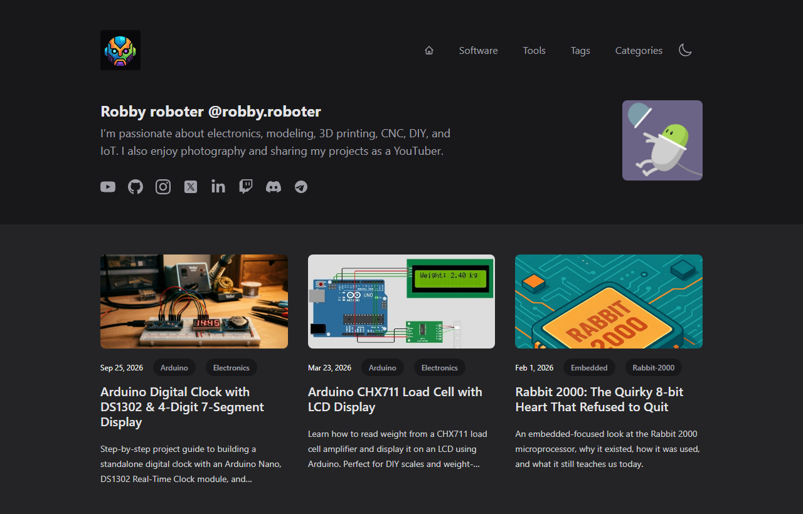

# begemotik.ee — Personal Embedded Electronics & Tech Blog

Welcome to the repository powering **[begemotik.ee](https://begemotik.ee)**, the personal technical blog and hardware project showcase of **Robby (@robby.roboter)**.

[](https://begemotik.ee)

This site serves as an open collection of hands-on guides, hardware deep dives, circuit simulations, and project documentation covering **microcontrollers, embedded systems, IoT, 3D printing, CNC, and DIY electronics**.

---

## 🚀 About the Content

The blog at [https://begemotik.ee](https://begemotik.ee) documents real-world hardware projects, low-level micro-controller programming, and electronic designs across a wide variety of platforms:

### 🔬 Core Topics & Articles

- **ESP32 & E-Ink Displays**:
  - LilyGO TTGO T5 V1.2 ePaper (E-Ink) features, pinouts, and custom firmware testing.
- **RISC-V & WCH Microcontrollers**:
  - Driving WS2812B (NeoPixel) RGB LEDs and SSD1306 OLED displays on WCH CH32V003 MCUs.
- **ARM & Microcontroller Hardware**:
  - **STM32**: I2C scanners with STM32 HAL and OLED integrations on Nucleo C031C6.
  - **GigaDevice & Geehy**: GD32E232K ARM processors with NeoPixel 8x8 matrices and Geehy APM32F072 MINI evaluation.
  - **Arduino**: Interfacing HX711/CHX711 load cells with LCD displays and joystick shields.
- **Retro Computing & Processor Architecture**:
  - Deep-dive technical reviews of legacy chips like the 8-bit **Rabbit 2000** microprocessor.
- **Electronics Simulation & Prototyping**:
  - Simulating Hitachi HD44780 LCD controllers with **SimulIDE** and **Embeetle**.
  - Direct Tinkercad LCD simulation without external libraries.
- **PCB Design & Fabrication**:
  - Hands-on reviews of online PCB design and manufacturing services (PCBX).
- **Maker Tech & Workshop**:
  - 3D printing, CNC machining, IoT sensors, and custom hardware builds.

---

## 🛠️ Built With

- **[Astro](https://astro.build)** — Fast, content-driven static site generator with Content Collections.
- **[Tailwind CSS](https://tailwindcss.com)** — Clean, responsive dark-mode styling.
- **[React](https://react.dev)** — Embedded interactive components.
- **[Vite PWA](https://vite-pwa-org.netlify.app/)** — Progressive Web App offline capabilities.
- **Markdown & MDX** — Structured technical post authoring with code syntax highlighting.

---

## 💻 Getting Started

### Prerequisites

- [Node.js](https://nodejs.org/) (v18 or higher)
- `npm` or `yarn`

### Installation & Local Development

```bash
# Clone the repository
git clone https://github.com/roboter/roboter.github.io.git
cd roboter.github.io

# Install dependencies
npm install

# Start development server
npm run dev
```

Open `http://localhost:4321` in your browser to view the blog locally.

---

## 🏗️ Build & Deployment

To create a static production build:

```bash
# Build production bundle to dist/
npm run build

# Preview build locally
npm run preview
```

The site is hosted live at **[https://begemotik.ee](https://begemotik.ee)**.

---

© 2026 **Robby roboter**. All rights reserved.

